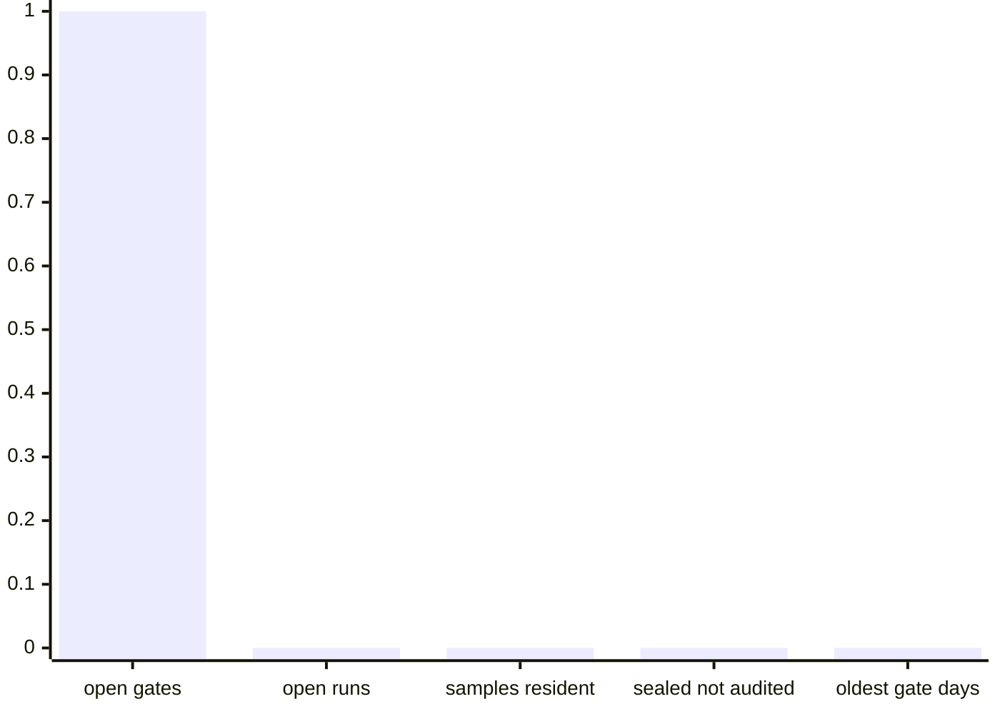
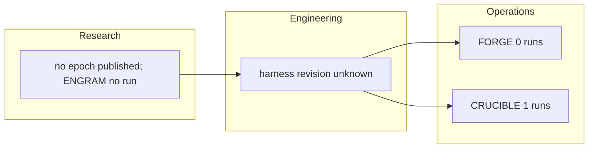
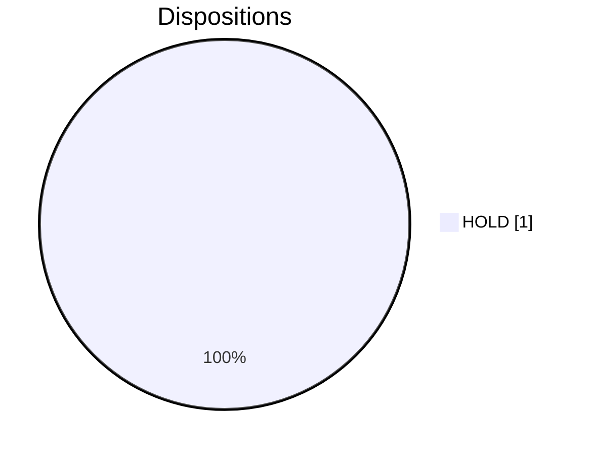
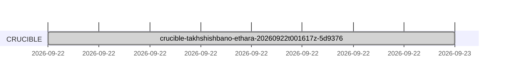
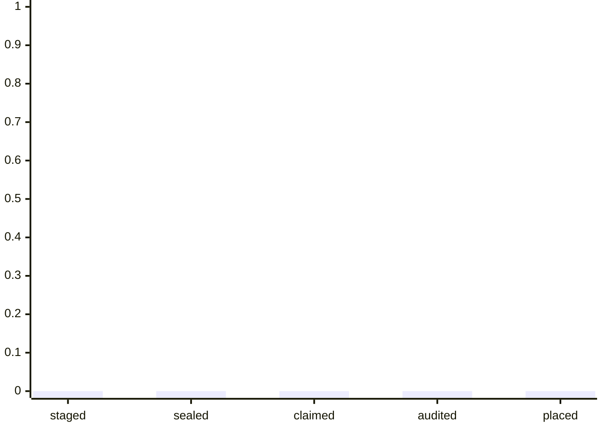
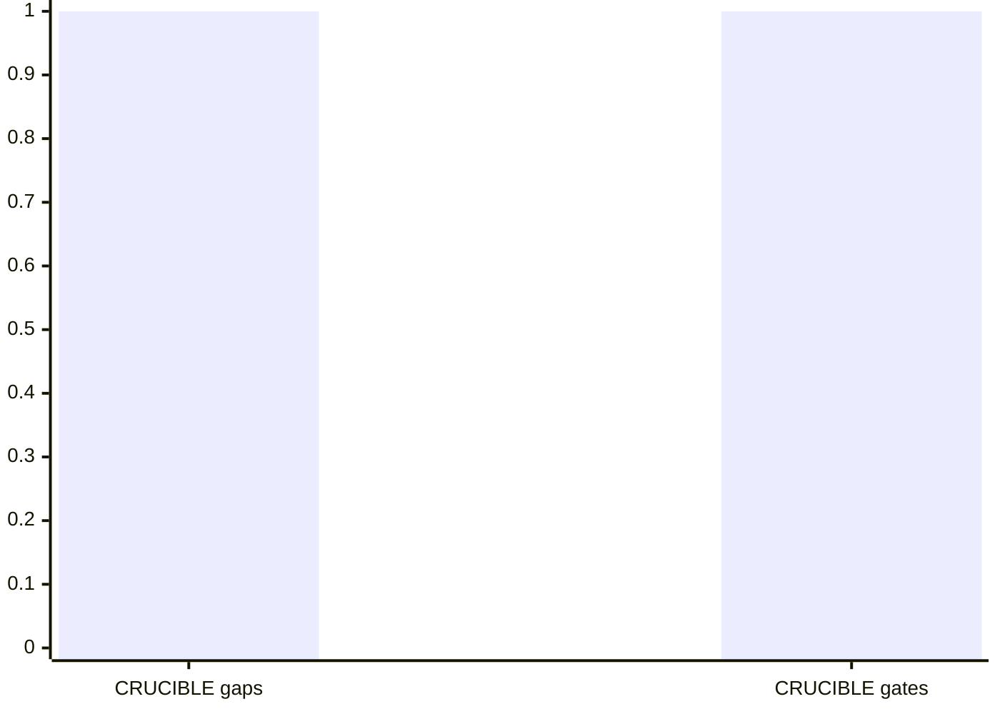
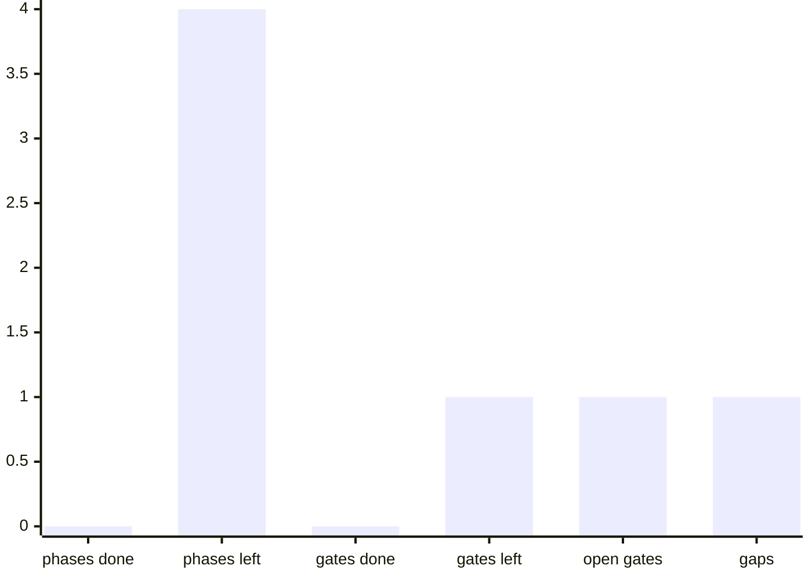

# TRACKING.md

> **GENERATED SECTION. DO NOT HAND-EDIT.**
>
> Every byte below is rendered by `trinity/tools/pipeline.py render-reports` from the run reports and per-run tracker cards already on disk. Anything typed into this file is erased by the next render, so change the work this page reports rather than the page.

As of 2026-09-22T00:38:30Z UTC, derived from recorded activity; every age and interval below is relative to that instant and no wall clock is read.

Three instruments do the work. ENGRAM remembers what earlier tasks cost and tells the other two where to aim, FORGE writes new tasks, and CRUCIBLE inspects finished tasks for defects. A run is one sitting of one instrument. A gate is a stop that waits for a person to sign. A gap is required work that nothing has covered yet. Every section below counts runs, gates, and gaps and charts what it counts, and the last section gives the plain meaning of every status word on this page.

## Headline

The whole project in six numbers. Every section after this one expands one of these rows.

| metric | value | plain meaning |
| --- | --- | --- |
| worst disposition | HOLD (waiting on a person or an open gap) | the worst outcome any run reached |
| open gates | 1 | stops waiting for a human signature |
| open runs | 0 | sittings that have not finished |
| samples occupancy | 0 of 30 (0%) | how full the public shelf of thirty is |
| sealed not audited | 0 | finished tasks still waiting to be inspected |
| oldest open gate age (days) | 0 | how long the longest signature has been waited on |



## Organizational lanes

Who is accountable for what, and the last moment each group signed something off. Research owns the memory, Engineering owns the machinery that runs tasks, and Operations runs the author and the inspector.

| lane | standing | last sign-off instant | artifact |
| --- | --- | --- | --- |
| Research | no epoch published; ENGRAM no run | unknown | no epoch published |
| Engineering | harness revision unknown; 0 harness runs | unknown | harness/ |
| Operations | FORGE 0 runs; CRUCIBLE 1 runs; 0 claims; 0 verdicts; sequential | 2026-09-22T00:38:30Z | EDICT.md, VERDICT.md |



## Disposition board

How the runs of each instrument ended. The worst outcome is shown first because one refusal holds the work whatever the rest did.

| instrument | worst disposition | BLOCK | HOLD | SHIP_ELIGIBLE | runs |
| --- | --- | --- | --- | --- | --- |
| ENGRAM | no run | no run | no run | no run | no run |
| FORGE | no run | no run | no run | no run | no run |
| CRUCIBLE | HOLD (waiting on a person or an open gap) | 0 | 1 | 0 | 1 |



## Decisions needed

Stops that are waiting for a person to sign, oldest first. Nothing behind a gate moves until someone signs it, and the chart below plots how many days each one has been waiting.

| gate | instrument | run | age (days) |
| --- | --- | --- | --- |
| scope sign-off gate | CRUCIBLE | crucible-takhshishbano-ethara-20260922t001617z-5d9376 | 0 |

```mermaid
xychart-beta
    x-axis ["scope sign-off gate CRUC"]
    y-axis 0 --> 1
    bar [0]
```

## Changed since boundary

What has happened since the last published boundary, so recent movement is visible without reading the whole history.

unavailable: no earlier boundary is recorded on disk

## Cycle timeline

When each run started and finished, one lane per instrument. A bar that never closes is a run still waiting.



## Bundle flow

A task moves through five stages in order: staged, sealed, claimed, audited, placed. A count that drops sharply between two stages is where work is piling up.

| stage | count | counted from |
| --- | --- | --- |
| staged | 0 | staging/ dirs |
| sealed | 0 | queue |
| claimed | 0 | claims |
| audited | 0 | verdicts |
| placed | 0 | samples + delivery residency |



## Samples occupancy

How full the public shelf is. It holds thirty tasks at a time, and a starter task leaves the shelf once it has taught the project what its techniques cost.

occupancy: 0 of 30 (0%)

`░░░░░░░░░░░░░░░░░░░░░░░░░░░░░░`

cumulative placements: 0

Occupancy counts what is on the shelf right now rather than everything ever placed, so it can fall as well as rise: a starter task leaves the shelf once it has taught the project what its techniques cost, and the next task takes its place.

## Aging work

Runs that have not finished yet, longest waiting first. A run ages because it is blocked, not because it is busy.

no open run is recorded

## Blockers and escalations

What is standing in the way: gaps are required work nothing covers yet, escalations are runs that raised a problem, and open gates are stops waiting for a signature.

| instrument | gaps | runs with escalations | open gate names |
| --- | --- | --- | --- |
| CRUCIBLE | 1 | 1 | scope sign-off gate |



## Sign-off log

Every sign-off recorded on disk, earliest first.

no sign-off is recorded

## ENGRAM

ENGRAM is the memory. It remembers what earlier tasks cost, expires evidence that has gone stale, and is the only instrument that talks to the other two.

- status: no run
- phase: no run
- progress: no run
- pending: no run

| run | principal | started | closed | run elapsed, including waits | disposition | phase | closure |
| --- | --- | --- | --- | --- | --- | --- | --- |
| no run | no run | no run | no run | no run | no run | no run | no run |

## FORGE

FORGE is the author. It writes new tasks in batches, proves each one against its own checks, and hands the sealed batch on to be inspected.

- status: no run
- phase: no run
- progress: no run
- pending: no run

| run | principal | started | closed | run elapsed, including waits | disposition | phase | closure |
| --- | --- | --- | --- | --- | --- | --- | --- |
| no run | no run | no run | no run | no run | no run | no run | no run |

## CRUCIBLE

CRUCIBLE is the inspector. It audits finished work against recorded evidence and never sees the difficulty targets FORGE was aiming at.

- status: HOLD (waiting on a person or an open gap)
- phase: R
- progress: phases 0 of 4 (0%), gates 0 of 1 (0%)
- pending: 1 open gate (scope sign-off gate), 1 gap



| run | principal | started | closed | run elapsed, including waits | disposition | phase | closure |
| --- | --- | --- | --- | --- | --- | --- | --- |
| crucible-takhshishbano-ethara-20260922t001617z-5d9376 | takhshishbano-ethara | 2026-09-22T00:18:45Z | 2026-09-22T00:38:30Z | 0d 00:19 | HOLD | R | closed |

## History

Every run ever recorded, in the order it started. A run that arrives late is inserted in order rather than appended.

| started | instrument | run | principal | disposition | phase | closed | closure |
| --- | --- | --- | --- | --- | --- | --- | --- |
| 2026-09-22T00:18:45Z | CRUCIBLE | crucible-takhshishbano-ethara-20260922t001617z-5d9376 | takhshishbano-ethara | HOLD | R | 2026-09-22T00:38:30Z | closed |

## Flag legend

The three outcomes any run can reach, worst first.

| flag | plain meaning |
| --- | --- |
| BLOCK | refused until a new candidate is built |
| HOLD | waiting on a person or an open gap |
| SHIP_ELIGIBLE | every local check passed, release still needs a signed disposition |

A flag may carry a reason after a colon, such as `HOLD:PILOT_REQUIRED`. Every reason this page prints is spelled out in brackets beside the flag it qualifies.

| reason | plain meaning |
| --- | --- |
| INVALID_PILOT | the test run cannot be proved against what was promised |
| INVALID_TASK | the task itself is malformed and has to be rebuilt |
| PILOT_REQUIRED | waiting for an outside signed test run |
| SUPPRESSED_MEASUREMENT | a measurement was weakened or its coverage was never shown |

The words this page uses for the work itself.

| term | plain meaning |
| --- | --- |
| run | one sitting of one instrument, from the moment it opens to the moment it closes |
| gate | a stop that waits for a person to sign before the work may continue |
| gap | required work that nothing has covered yet |
| phase | a numbered step inside a run |
| bundle | one finished task, packaged so it can be run by an outside grader |
| staged | written but not yet frozen |
| sealed | frozen, so its bytes can no longer change |
| claimed | picked up by the inspector |
| audited | inspected, with a verdict recorded |
| placed | moved onto the public shelf or into the private corpus |
| epoch | a published, frozen version of the memory |
| escalation | a problem a run raised for someone above it to settle |
